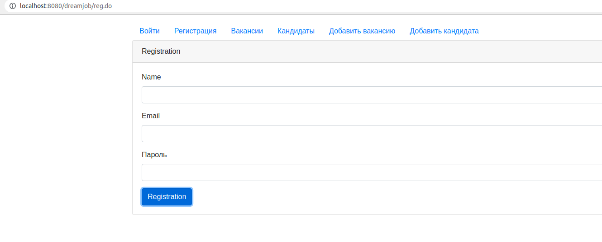
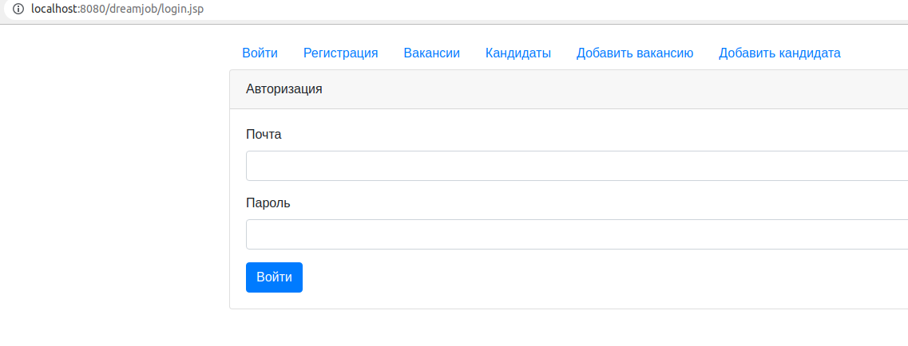
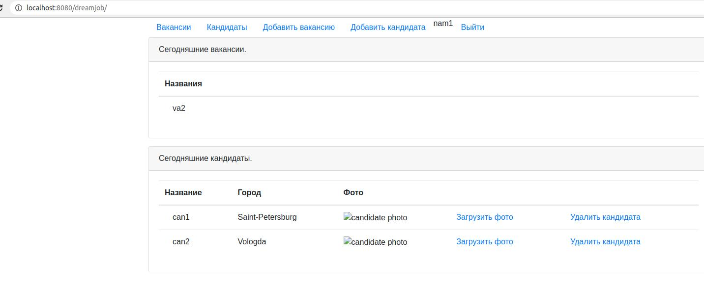
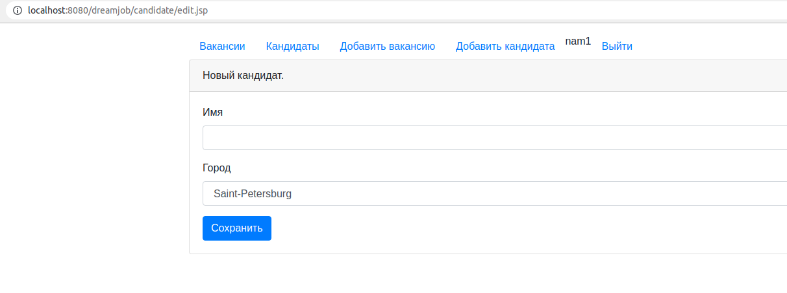
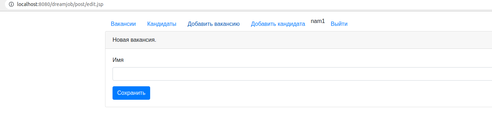
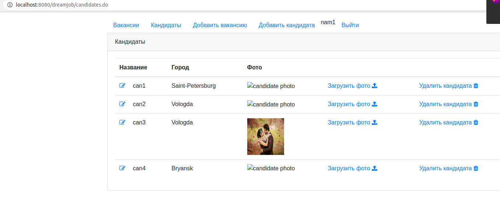
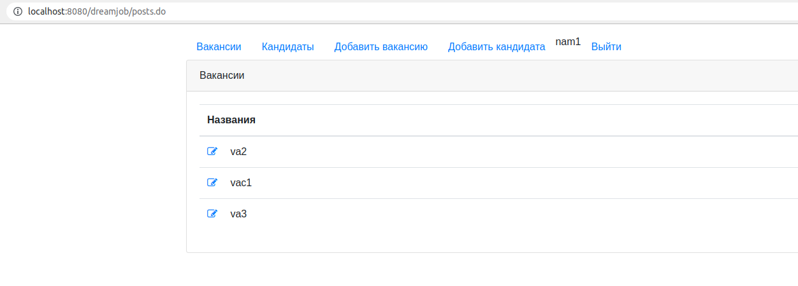

Приложение биржа работы.

В системе будут два типа пользователей: кандидаты и кадровики.

Кандидаты будут публиковать резюме. Кандидаты могут откликнуться на вакансию.

Кадровики будут публиковать вакансии о работе. Кадровик может пригласить на вакансию кандидата.

